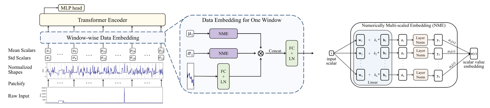

# [TMLR 2024] NuTime

<h4 align="center">

NuTime: Numerically Multi-Scaled Embedding for Large-Scale Time-Series Pretraining

[Chenguo Lin](https://chenguolin.github.io), [Xumeng Wen](https://github.com/xumwen), [Wei Cao](https://weicao1990.github.io/), [Congrui Huang](https://dblp.org/pid/26/8737.html), [Jiang Bian](https://sites.google.com/view/jiangbian), [Stephen Lin](https://www.microsoft.com/en-us/research/people/stevelin/), [Zhirong Wu](https://www.microsoft.com/en-us/research/people/wuzhiron/)

[](https://openreview.net/forum?id=TwiSBZ0p9u)
[](https://arxiv.org/abs/2310.07402)
[](./LICENSE)

<p>
    
</p>

</h4>

This repository contains the official implementation of the paper: [NuTime: Numerically Multi-Scaled Embedding for Large-Scale Time-Series Pretraining](https://arxiv.org/abs/2310.07402), which is accepted to TMLR 2024.
In this work, we propose the <b>NuTime</b> model for large-scale time series pretraining. The model is based on the Transformer architecture, which takes input as a set of tokens from non-overlapping windows. Each window is represented by its normalized shape, the window mean and standard deviation. We develop a <b>numerically multi-scaled embedding</b> method (NME) for representing the scalar values of mean and std. The model can <u>take raw values of time-series data in <b>any numerical scales</b> as input <b>without</b> any data normalization and transformation</u>.

Feel free to contact me (chenguolin@stu.pku.edu.cn) or open an issue if you have any questions or suggestions.


## 📢 News
- **2024-11-12**: Checkpoint of the self-supervised pretrained NuTime is released.
- **2024-11-12**: Codes about data preprocessing, training, evaluation are released.
- **2024-07-15**: It might take some time to clean the entire codebase for releasing, so we first provide the code about **window & mean & std embeddings**, which is the essential part of the proposed NuTime, at [here](./src/models/encoders/WindowNormEncoder.py).
- **2024-07-10**: NuTime is accepted to TMLR 2024.


## 📋 TODO
- [x] Release the training and evaluation code
- [x] Release the self-supervised pretrained NuTime


## 🔧 Installation
Please install PyTorch according to your CUDA version first. There are not restrictions on the torch version, feel free to use your preferred one.
```bash
git clone https://github.com/microsoft/NuTime.git
cd NuTime
bash settings/setup.sh
```


## 📊 Dataset
Please refer to [data/preprocess.py](./data/preprocess.py).
We provide the script to preprocess the data including: `UCR`, `UEA`, `SleepEDF`, `Epilepsy`, etc.
The processed and splitted `Epilpesy` dataset is provided in [datasets/Epilepsy](./datasets/Epilepsy) for example.

Due to license constraints, we cannot provide the download link of the pretraining data. However, the dataset can be gathered according to the process described in the section 4.1 of the paper.


## 🚀 Usage
- The core part of our work is `WindowNormEncoder` in [models/encoders/WindowNormEncoder.py](./models/encoders/WindowNormEncoder.py) and `WinT` in [models/networks.py](./models/networks.py). You can directly view the code for implementation details. Other codes are merely for data preprocessing, training, evaluation and ablation study, which could be ignored essentially.

- Checkpoint of the self-supervised (i.e., BYOL-style) pretrained NuTime (with `9` multi-scaled embeddings) is provided in [ckpt/checkpoint_bias9.pth](./ckpt/checkpoint_bias9.pth)

## Run Script
To pretrain, fine-tune the model, an example script is provided in [./run.sh](./run.sh).


## 📚 Citation
If you find our work helpful, please consider citing:
```bibtex
@article{lin2024nutime,
  title={NuTime: Numerically Multi-Scaled Embedding for Large-Scale Time-Series Pretraining},
  author={Chenguo Lin and Xumeng Wen and Wei Cao and Congrui Huang and Jiang Bian and Stephen Lin and Zhirong Wu},
  journal={Transactions on Machine Learning Research (TMLR)},
  year={2024}
}
```

## Contributing

This project welcomes contributions and suggestions.  Most contributions require you to agree to a
Contributor License Agreement (CLA) declaring that you have the right to, and actually do, grant us
the rights to use your contribution. For details, visit https://cla.opensource.microsoft.com.

When you submit a pull request, a CLA bot will automatically determine whether you need to provide
a CLA and decorate the PR appropriately (e.g., status check, comment). Simply follow the instructions
provided by the bot. You will only need to do this once across all repos using our CLA.

This project has adopted the [Microsoft Open Source Code of Conduct](https://opensource.microsoft.com/codeofconduct/).
For more information see the [Code of Conduct FAQ](https://opensource.microsoft.com/codeofconduct/faq/) or
contact [opencode@microsoft.com](mailto:opencode@microsoft.com) with any additional questions or comments.

## Trademarks

This project may contain trademarks or logos for projects, products, or services. Authorized use of Microsoft 
trademarks or logos is subject to and must follow 
[Microsoft's Trademark & Brand Guidelines](https://www.microsoft.com/en-us/legal/intellectualproperty/trademarks/usage/general).
Use of Microsoft trademarks or logos in modified versions of this project must not cause confusion or imply Microsoft sponsorship.
Any use of third-party trademarks or logos are subject to those third-party's policies.
